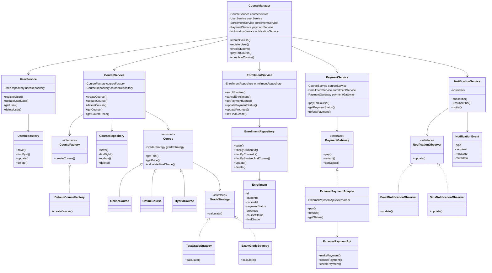

# Архитектура сервисов и приложений

## Сессионное задание

Репозиторий содержит выполнение сессионного задания по дисциплине **«Архитектура сервисов и приложений»**.

---

# Задание 1. Рефакторинг системы управления онлайн-курсами

## 1. Краткий анализ исходной системы

В исходной реализации система управления онлайн-курсами построена вокруг класса `CourseManager`. Этот класс выполняет практически весь функционал.

Основные проблемы исходной реализации:

1. **Слишком много обязанностей в одном классе.**
   `CourseManager` объединяет бизнес-логику, создание объектов, уведомления и работу с внешними сервисами, что нарушает принцип разделения ответственности.

2. **Жёсткое создание курсов.**
   Курсы создаются через условные конструкции и прямые вызовы конструкторов. При добавлении нового типа курса необходимо изменять существующий код.

3. **Негибкий расчёт итоговой оценки.**
   Алгоритм оценивания закреплён внутри `CourseManager` и не может изменяться независимо от основной логики.

4. **Уведомления встроены в бизнес-логику.**
   Вызовы отправки уведомлений находятся внутри методов `CourseManager`, поэтому добавление нового канала уведомлений требует изменения класса.

5. **Прямая зависимость от платёжного API.**
   Система напрямую использует классы внешнего платёжного сервиса, из-за чего смена провайдера оплаты приведёт к изменению бизнес-логики.

6. **Дублирование логики.**
   Похожие действия повторяются в разных методах, что затрудняет сопровождение и повышает риск ошибок.


## 2. Предлагаемая структура системы

Для устранения проблем исходной архитектуры класс `CourseManager` предлагается оставить в системе, но изменить его роль. Теперь он не выполняет всю работу самостоятельно, а выступает как управляющий сервис, который координирует взаимодействие отдельных компонентов.

В новой архитектуре `CourseManager` использует следующие сервисы:

* `CourseService` — сервис управления курсами;
* `UserService` — сервис управления пользователями;
* `EnrollmentService` — сервис учёта связи между студентами и курсами;
* `PaymentService` — сервис оплаты курсов;
* `NotificationService` — сервис рассылки уведомлений.

### 2.1 Основная идея архитектуры

`CourseService` отвечает за создание, изменение, удаление и получение информации о курсах. Для создания объектов курсов он использует `CourseFactory`, а для хранения данных — `CourseRepository`. Благодаря этому `CourseManager` не зависит от конкретных классов курсов.

`UserService` отвечает за регистрацию пользователей, изменение пользовательских данных и получение информации о пользователях. Для работы с данными пользователей используется `UserRepository`.

`EnrollmentService` отвечает за запись студентов на курсы и хранение информации о связи между студентом и курсом. В этой связи могут храниться статус оплаты, прогресс прохождения курса, итоговая оценка и другие метаданные. Для хранения таких данных используется `EnrollmentRepository`.

`PaymentService` отвечает за проведение оплаты. Он получает стоимость курса из `CourseService`, проверяет статус оплаты через `EnrollmentService`, выполняет оплату через внешний платёжный сервис и после успешной оплаты обновляет статус оплаты.

`NotificationService` отвечает за рассылку уведомлений. Он работает по паттерну Observer: хранит список наблюдателей и передаёт им события, происходящие в системе. Например, уведомления могут отправляться при регистрации пользователя, записи на курс, успешной оплате или завершении курса.

Также в системе выделяется абстрактный класс `Course`, от которого наследуются конкретные типы курсов: `OnlineCourse`, `OfflineCourse` и `HybridCourse`. Каждый курс содержит стратегию расчёта итоговой оценки — `GradeStrategy`. Это позволяет использовать разные алгоритмы оценивания для разных типов курсов.

### 2.2 Диаграмма классов



## 3. Описание основных классов и их ответственности

| Класс / интерфейс           | Ответственность                                                                                                                                                                                       |
| --------------------------- | ----------------------------------------------------------------------------------------------------------------------------------------------------------------------------------------------------- |
| `CourseManager`             | Управляющий сервис системы. Координирует работу остальных компонентов, но не содержит внутри себя всю бизнес-логику. Использует сервисы курсов, пользователей, записи на курсы, оплаты и уведомлений. |
| `CourseService`             | Отвечает за управление курсами: создание, изменение, удаление и получение информации о курсах. Для создания объектов использует `CourseFactory`, а для хранения данных — `CourseRepository`.          |
| `CourseFactory`             | Интерфейс фабрики для создания курсов разных типов. Позволяет не создавать `OnlineCourse`, `OfflineCourse` и другие классы напрямую в бизнес-логике.                                                  |
| `DefaultCourseFactory`      | Конкретная реализация фабрики курсов. Создаёт нужный объект курса в зависимости от переданного типа и данных.                                                                                         |
| `Course`                    | Абстрактный класс курса. Содержит общие свойства и методы для всех курсов, а также ссылку на стратегию расчёта итоговой оценки `GradeStrategy`.                                                       |
| `OnlineCourse`              | Конкретный тип курса, предназначенный для дистанционного обучения. Наследуется от `Course`.                                                                                                           |
| `OfflineCourse`             | Конкретный тип курса, предназначенный для очного обучения. Наследуется от `Course`.                                                                                                                   |
| `HybridCourse`              | Конкретный тип курса, объединяющий элементы онлайн- и офлайн-обучения. Наследуется от `Course`.                                                                                                       |
| `GradeStrategy`             | Интерфейс стратегии расчёта итоговой оценки. Позволяет задавать разные алгоритмы оценивания для разных курсов.                                                                                        |
| `TestGradeStrategy`         | Реализация стратегии, при которой итоговая оценка рассчитывается на основе тестов и заданий.                                                                                                          |
| `ExamGradeStrategy`         | Реализация стратегии, при которой итоговая оценка рассчитывается на основе экзамена.                                                                                                                  |
| `UserService`               | Отвечает за работу с пользователями: регистрацию, изменение данных, получение информации и удаление пользователей.                                                                                    |
| `UserRepository`            | Отвечает за хранение, поиск, обновление и удаление данных пользователей.                                                                                                                              |
| `EnrollmentService`         | Отвечает за запись студентов на курсы и управление связью между студентом и курсом. Хранит информацию о статусе оплаты, прогрессе прохождения, итоговой оценке и других метаданных.                   |
| `Enrollment`                | Сущность, описывающая связь между студентом и курсом. Содержит идентификаторы студента и курса, статус оплаты, прогресс, статус прохождения и итоговую оценку.                                        |
| `EnrollmentRepository`      | Отвечает за сохранение, поиск, обновление и удаление записей о связях между студентами и курсами.                                                                                                     |
| `PaymentService`            | Отвечает за процесс оплаты курса. Получает стоимость курса из `CourseService`, проверяет статус оплаты через `EnrollmentService`, вызывает платёжный шлюз и обновляет статус оплаты.                  |
| `PaymentGateway`            | Интерфейс для работы с платёжными системами. Определяет общие методы оплаты, возврата и проверки статуса платежа.                                                                                     |
| `ExternalPaymentAdapter`    | Адаптер для внешнего платёжного API. Преобразует вызовы системы к формату конкретного платёжного сервиса.                                                                                             |
| `ExternalPaymentApi`        | Внешний платёжный сервис, с которым система взаимодействует через адаптер.                                                                                                                            |
| `NotificationService`       | Сервис рассылки уведомлений. Хранит список наблюдателей и уведомляет их о событиях в системе.                                                                                                         |
| `NotificationObserver`      | Интерфейс наблюдателя, который получает событие и обрабатывает его.                                                                                                                                   |
| `EmailNotificationObserver` | Наблюдатель для отправки уведомлений по электронной почте.                                                                                                                                            |
| `SmsNotificationObserver`   | Наблюдатель для отправки уведомлений по SMS.                                                                                                                                                          |
| `NotificationEvent`         | Объект события, содержащий тип события, получателя, сообщение и дополнительные данные.                                                                                                                |

## 4. Соответствие проблем, решений и паттернов

| Проблема | Решение | Используемый паттерн | Обоснование |
|---|---|---|---|
| В классе `CourseManager` сосредоточено слишком много обязанностей | Обязанности разделены между `CourseService`, `UserService`, `EnrollmentService`, `PaymentService` и `NotificationService` | Разделение ответственности | Каждый сервис отвечает за свою часть системы, а `CourseManager` только координирует их работу |
| Создание курсов реализовано через условные конструкции и прямые вызовы конструкторов | Создание курсов вынесено в `CourseFactory`, которую использует `CourseService` | `Factory Method` | Добавление нового типа курса не требует изменения `CourseManager`; создание объектов сосредоточено в фабрике |
| Алгоритм расчёта итоговой оценки жёстко зафиксирован в одном методе | Расчёт оценки вынесен в интерфейс `GradeStrategy`, который используется внутри класса `Course` | `Strategy` | Для разных курсов можно применять разные алгоритмы оценивания без изменения основной логики |
| Отправка уведомлений встроена в бизнес-логику | Уведомления вынесены в `NotificationService`, который рассылает события наблюдателям | `Observer` | Бизнес-логика не зависит от конкретного канала уведомлений; можно добавить email, SMS или другой канал |
| Работа с платёжной системой реализована напрямую через внешний API | Введён интерфейс `PaymentGateway` и адаптер `ExternalPaymentAdapter` | `Adapter` | `PaymentService` работает с общим интерфейсом, поэтому внешний платёжный сервис можно заменить без изменения бизнес-логики |
| В коде присутствует дублирование логики | Повторяющиеся операции вынесены в отдельные сервисы и репозитории | DRY, разделение ответственности | Общая логика хранится в одном месте, поэтому её проще сопровождать и изменять |

## 5. Вывод

В результате переработки архитектуры класс `CourseManager` перестаёт быть перегруженным и выполняет роль управляющего сервиса. Основные обязанности системы распределены между отдельными компонентами: `CourseService`, `UserService`, `EnrollmentService`, `PaymentService` и `NotificationService`.

Создание курсов вынесено в фабрику, расчёт итоговой оценки реализован через стратегии, работа с платёжной системой изолирована с помощью адаптера, а уведомления организованы через механизм наблюдателей. Это позволяет добавлять новые типы курсов, алгоритмы оценивания, платёжные сервисы и каналы уведомлений без изменения основной бизнес-логики.

Предложенная структура снижает связанность компонентов, уменьшает дублирование кода и соответствует принципам DRY, KISS и разделения ответственности.


---

# Задание 2. Анализ архитектуры системы бронирования столиков

## 1. Краткое описание системы

Рассматривается система бронирования столиков в ресторанах. Она состоит из двух микросервисов:

- `BookingService` — сервис бронирований, который принимает запросы пользователей и создаёт бронирование;
- `RestaurantService` — сервис ресторанов, который хранит информацию о ресторанах и свободных столиках.

В текущей архитектуре при каждом запросе на бронирование `BookingService` синхронно вызывает `RestaurantService` по REST, чтобы проверить доступность столика и занять его. Если вызов завершается ошибкой или таймаутом, пользовательский запрос также завершается ошибкой.

При обычной нагрузке система обрабатывает около 100 запросов в секунду. Однако во время резкого всплеска нагрузка возрастает до 50 000 запросов в секунду и держится 10–15 минут. В такой ситуации сервисы бронирования падают под нагрузкой, а единственный экземпляр `RestaurantService` становится потенциальным узким местом.

## 2. Центральные проблемы архитектуры

### Проблема 1. Синхронная зависимость от `RestaurantService`

Первая центральная проблема заключается в том, что `BookingService` напрямую и синхронно зависит от `RestaurantService`.

Каждый пользовательский запрос приводит к REST-вызову во внешний сервис ресторанов. Из-за этого при пиковой нагрузке количество запросов к `RestaurantService` также резко возрастает. Так как `RestaurantService` работает в единственном экземпляре и не может быть масштабирован, он становится узким местом всей системы.

Кроме того, ошибка или таймаут при обращении к `RestaurantService` сразу приводит к ошибке пользовательского запроса. Это делает систему менее устойчивой: отказ одного сервиса напрямую влияет на доступность другого.

### Решение проблемы 1. Асинхронная обработка через очередь сообщений

Так как по условию бронирование может быть обработано в течение 24 часов, нет необходимости выполнять его мгновенно в рамках пользовательского запроса.

Вместо синхронного вызова `RestaurantService` можно использовать очередь сообщений:

1. Пользователь отправляет заявку на бронирование.
2. `BookingService` сохраняет заявку со статусом `PENDING`.
3. Заявка помещается в очередь сообщений.
4. `Booking Worker` постепенно забирает заявки из очереди.
5. `Booking Worker` обращается к `RestaurantService` с контролируемой скоростью.
6. После успешной обработки статус заявки меняется на `CONFIRMED`.

Такой подход позволяет сгладить пиковую нагрузку. Во время всплеска система быстро принимает заявки, а обработка выполняется постепенно. Это защищает единственный экземпляр `RestaurantService` от перегрузки.

Так как по условию свободных столиков достаточно для всех пользователей, бизнес-требование “не отказывать в бронировании во время пика” сохраняется.

---

### Проблема 2. Неравномерное распределение нагрузки между экземплярами `BookingService`

Вторая центральная проблема связана с тем, что мобильное приложение само выбирает экземпляр `BookingService` из заранее заданного списка IP-адресов.

Так как список IP-адресов у всех пользователей одинаковый и находится в одном порядке, большинство запросов сначала попадает на первый экземпляр сервиса. Когда он становится недоступен, приложение начинает отправлять запросы на следующий экземпляр. В результате сервисы бронирования перегружаются и падают последовательно.

Даже если поднять много экземпляров `BookingService`, такая схема не обеспечит нормальное распределение нагрузки, потому что приложение не балансирует запросы равномерно.

### Решение проблемы 2. Единая точка входа и балансировщик нагрузки

Чтобы устранить эту проблему, мобильное приложение не должно обращаться напрямую к списку IP-адресов экземпляров `BookingService`.

Вместо этого нужно использовать единую точку входа:

- `Load Balancer`;
- `API Gateway`;
- DNS-имя, за которым находится балансировщик.

В этом случае мобильное приложение отправляет запрос на один общий адрес, а балансировщик распределяет нагрузку между всеми доступными экземплярами `BookingService`.

Это позволяет:

- равномерно распределять запросы;
- исключать недоступные экземпляры из обработки;
- горизонтально масштабировать `BookingService`;
- избежать последовательного падения сервисов.

## 3. Предлагаемая схема работы

После изменения архитектуры взаимодействие компонентов может выглядеть следующим образом:

```text
Mobile App
    ↓
Load Balancer / API Gateway
    ↓
BookingService
    ↓
Message Queue
    ↓
Booking Worker
    ↓
RestaurantService
```

В такой схеме `BookingService` быстро принимает заявку и не ждёт ответа от `RestaurantService`. Основная нагрузка во время пика накапливается в очереди сообщений.

`Booking Worker` — это отдельный сервис-обработчик, который берёт заявки из очереди и постепенно передаёт их в `RestaurantService`. Благодаря этому единственный экземпляр `RestaurantService` получает не резкий всплеск запросов, а равномерную и контролируемую нагрузку.

Так как по условию свободных столиков достаточно для всех пользователей, система может принимать все заявки без отказов, а затем обрабатывать их в течение допустимых 24 часов.

## 4. Таблица проблем и решений

| Центральная проблема | Решение | Обоснование |
|---|---|---|
| Синхронная зависимость `BookingService` от единственного экземпляра `RestaurantService` | Использовать очередь сообщений между сервисами: `BookingService` принимает заявку и помещает её в очередь, а `Booking Worker` постепенно забирает заявки из очереди и передаёт их в `RestaurantService` | Очередь позволяет накопить пиковые запросы и обработать их позже, не перегружая единственный экземпляр `RestaurantService` |
| Неравномерное распределение нагрузки между экземплярами `BookingService` из-за фиксированного списка IP-адресов в мобильном приложении | Использовать единую точку входа: `Load Balancer` или `API Gateway` | Запросы будут равномерно распределяться между экземплярами `BookingService`, а недоступные экземпляры будут исключаться из обработки |

## 5. Вывод

В описанной архитектуре присутствуют две основные проблемы: синхронная зависимость сервиса бронирований от сервиса ресторанов и неправильное распределение нагрузки между экземплярами сервиса бронирований.

Для решения первой проблемы предлагается перейти к асинхронной обработке заявок через очередь сообщений. Это позволит принимать пиковые запросы без немедленной нагрузки на `RestaurantService` и обрабатывать бронирования постепенно.

Для решения второй проблемы необходимо использовать балансировщик нагрузки или API Gateway. Тогда мобильное приложение будет обращаться к единой точке входа, а запросы будут равномерно распределяться между экземплярами `BookingService`.

Такая архитектура позволит системе выдерживать кратковременные пики нагрузки, не перегружать единственный экземпляр `RestaurantService` и не отказывать пользователям в создании заявок на бронирование.
